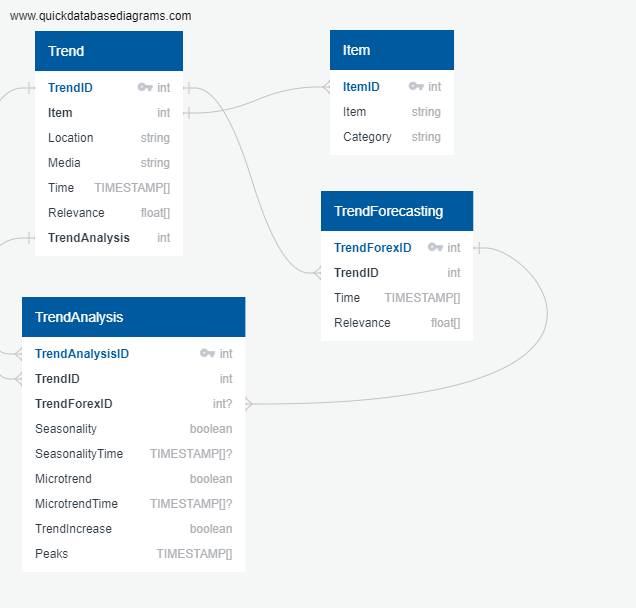

# Fashion Trend Database

Database Commands for data analysis and forecasting on Fashion Trends

## Goals:

- Save time series data fetched from APIs to database
- Filters for country and media (web search, youtube, shopping ...)
- Structured data on tables
- Separated tables for existing and forecast timeseries
- Data analysis table

## Data:

- Data fetched and cleaned from PyTrends API in relation to fashion items
- Time series data analysis
- Time series forecasting

## Database:

PostgresSQL database was chosen because:

- structure database
- it has more datatypes than MySQL which allows to better represent the data
- open source and high support

## Database Schema:

